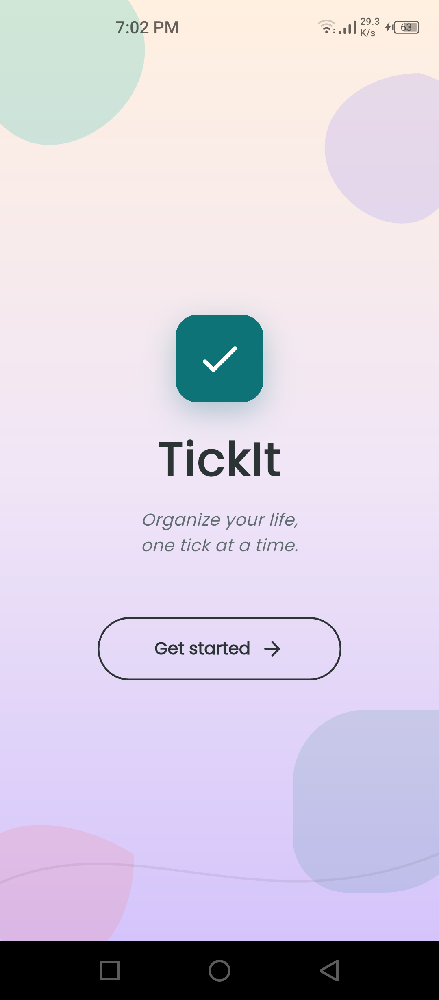
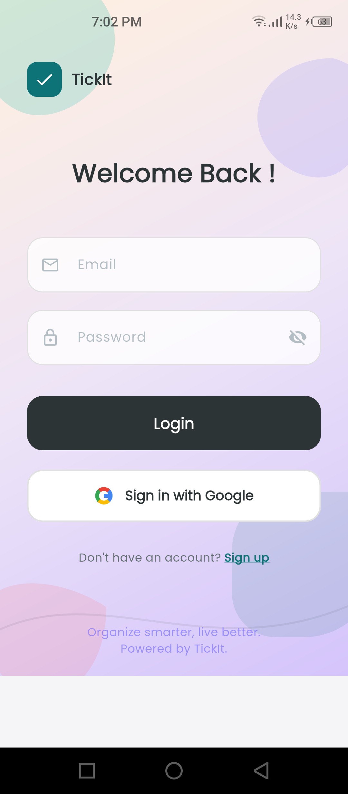
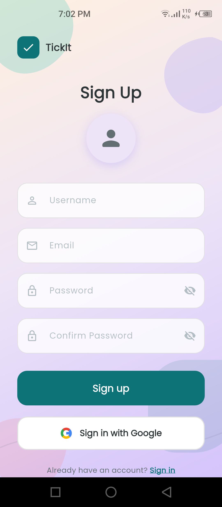
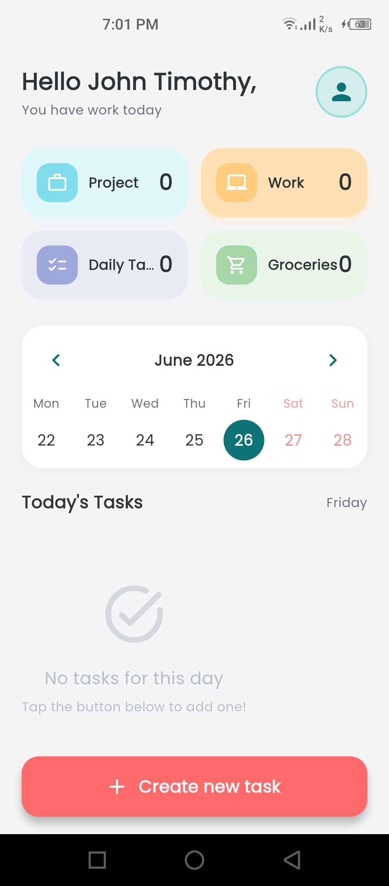

# TickIt — Task Management App

A smart task management app built with Flutter and Firebase. Organize your life, one tick at a time.


## Features

- **Splash Screen** — Animated branding with gradient background
- **Authentication** — Email/password login & signup + Google Sign-In
- **Home Dashboard** — Category cards, weekly calendar strip, today's tasks
- **Task Management** — Add, delete, mark complete with real-time updates
- **Data Persistence** — Firebase Firestore + SharedPreferences offline caching
- **Modern UI** — Poppins font, teal/coral/indigo palette, organic blob shapes

| Splash Screen | Login Screen |
| :---: | :---: |
|  |  |

| Signup Screen | Home Dashboard |
| :---: | :---: |
|  |  |

## Tech Stack

| Layer | Technology |
|-------|-----------|
| Framework | Flutter (Dart) |
| Auth | Firebase Authentication |
| Database | Cloud Firestore |
| Local Cache | SharedPreferences |
| Calendar | table_calendar |
| Fonts | Google Fonts (Poppins) |

## Project Structure

```
lib/
├── main.dart                    # App entry point with Firebase init
├── app.dart                     # MaterialApp configuration
├── config/
│   ├── theme.dart               # Colors, typography, theme
│   └── routes.dart              # Named route definitions
├── models/
│   └── task_model.dart          # Task data model
├── services/
│   ├── auth_service.dart        # Firebase Auth wrapper
│   └── task_service.dart        # Firestore CRUD + caching
├── screens/
│   ├── splash_screen.dart       # Animated splash
│   ├── login_screen.dart        # Login with email + Google
│   ├── signup_screen.dart       # Registration form
│   └── home_screen.dart         # Dashboard with tasks
└── widgets/
    ├── gradient_background.dart # Reusable gradient + blobs
    ├── custom_text_field.dart   # Styled input field
    ├── category_card.dart       # Category summary card
    ├── task_tile.dart           # Task list item
    └── google_sign_in_button.dart
```

## Setup Instructions

### Prerequisites

- [Flutter SDK](https://docs.flutter.dev/get-started/install) (3.x or later)
- [Firebase CLI](https://firebase.google.com/docs/cli) installed globally
- [FlutterFire CLI](https://firebase.flutter.dev/docs/cli/) installed:
  ```bash
  dart pub global activate flutterfire_cli
  ```
- An Android device or emulator

### Step 1: Clone the Repository

```bash
git clone https://github.com/YOUR_USERNAME/tick_it.git
cd tick_it
```

### Step 2: Install Dependencies

```bash
flutter pub get
```

### Step 3: Set Up Firebase

1. **Create a Firebase project** at [Firebase Console](https://console.firebase.google.com/)

2. **Enable Authentication providers:**
   - Go to **Authentication → Sign-in method**
   - Enable **Email/Password**
   - Enable **Google** (add your SHA-1 key for Android)

3. **Create Firestore Database:**
   - Go to **Firestore Database → Create database**
   - Start in **test mode** (for development)

4. **Configure Firebase in the project:**
   ```bash
   flutterfire configure
   ```
   This generates `lib/firebase_options.dart`.

5. **Update `lib/main.dart`:**
   - Uncomment the `import 'firebase_options.dart';` line
   - Uncomment the `Firebase.initializeApp(options: ...)` block
   - Remove the temporary `try/catch` Firebase init block

### Step 4: Add SHA-1 for Google Sign-In (Android)

```bash
cd android
./gradlew signingReport
```

Copy the SHA-1 fingerprint and add it to your Firebase project:
**Firebase Console → Project Settings → Your Android app → Add fingerprint**

### Step 5: Run the App

```bash
flutter run
```

## Color Palette

| Role | Color | Hex |
|------|-------|-----|
| Primary (Deep Teal) | 🟢 | `#0D7377` |
| Primary Light (Aqua Mint) | 🟢 | `#14BDAC` |
| Secondary (Warm Coral) | 🔴 | `#FF6B6B` |
| Accent (Soft Indigo) | 🟣 | `#6C63FF` |
| Gradient Start | 🟠 | `#FFF0E0` |
| Gradient End | 🟣 | `#D4C4FB` |

## Roadmap

- [x] Splash screen
- [x] Login / Signup with Firebase Auth
- [x] Home screen with categories + calendar
- [ ] Create / Edit task screen
- [ ] Full monthly calendar view
- [ ] Firebase Cloud Messaging (push notifications)
- [ ] Dark mode

## License

This project is for educational purposes.
