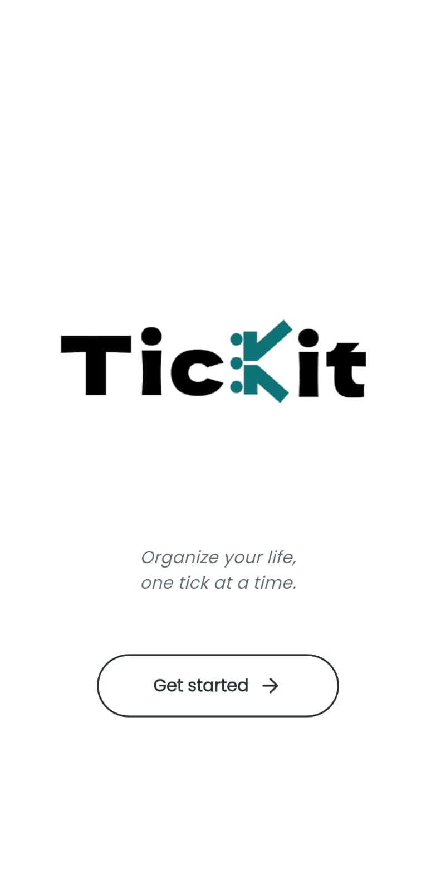
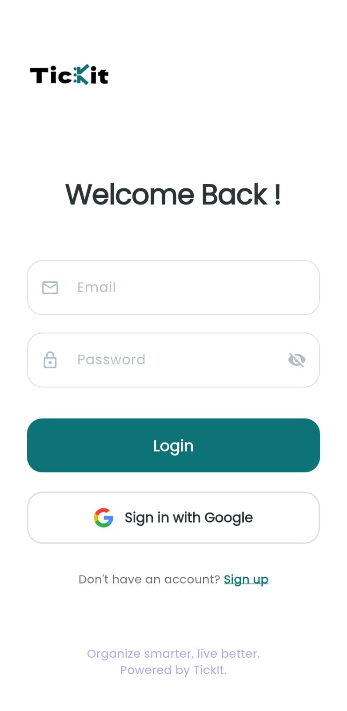
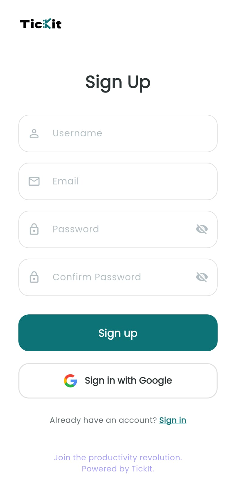
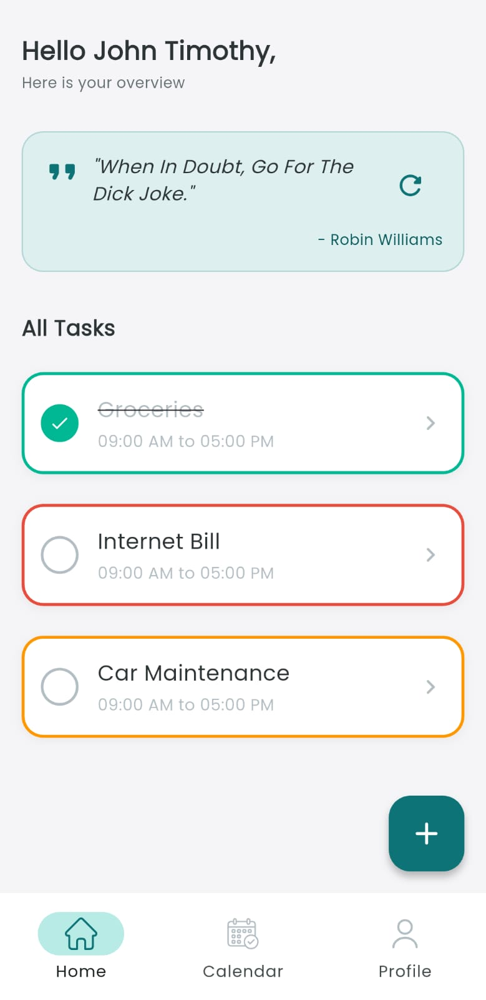
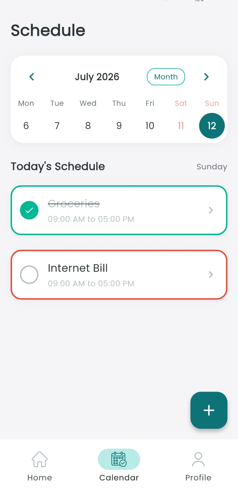
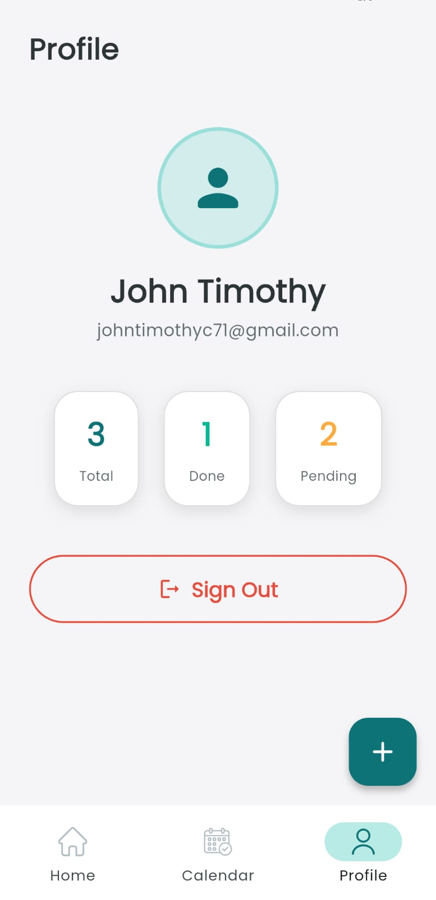

# TickIt - Task Management App

TickIt is a beautifully designed, feature-rich task management application built in Flutter as part of the Developer's Hub Co. Internship (Cycle 2, Weeks 4-6). It integrates modern UI aesthetics, real-time cloud data, and robust state management.

## 📸 Screenshots
<p align="center">
  
  
  
</p>
<p align="center">
  
  
  
</p>

---

## 🎯 Features & Deliverables

### 1. API Integration & Networking
- **Daily Quotes**: Fetches daily motivational quotes from a public API instead of generic user data.
- **Robust Parsing**: Safely parses JSON responses and displays them on the Home Screen.
- **Error Handling**: Implements UI loading spinners and handles failed API requests gracefully.

### 2. Firebase Authentication & Database
- **Secure Authentication**: Full login and signup flows powered by Firebase Authentication (Email/Password & Google Sign-In).
- **Cloud Firestore**: Stores and retrieves user data (name, email) and all scheduled tasks in real-time.
- **User Profiles**: Displays user details securely fetched from the Firestore database.

### 3. State Management & Enhancements
- **Provider Pattern**: Refactored entirely to use the `provider` package instead of `setState` for robust app state management.
- **Real-time UI**: Task additions, edits, and deletions update the UI instantaneously via Provider.
- **UI/UX Optimizations**: Features modern glassmorphism, subtle micro-animations, and performant layouts.
- **Bonus Feature (FCM)**: Successfully integrated Firebase Cloud Messaging for robust, targeted push notifications!

---

## 🚀 Setup Instructions

1. **Clone the repository:**
   ```bash
   git clone <your-repo-url>
   cd tick_it
   ```

2. **Install Dependencies:**
   ```bash
   flutter pub get
   ```

3. **Firebase Setup:**
   Ensure your Firebase project is configured for Android/iOS. Download the corresponding `google-services.json` and `GoogleService-Info.plist` and place them in their respective native directories. (Currently configured via `flutterfire configure`).

4. **Run the App:**
   ```bash
   flutter run
   ```

## 🛠 Tech Stack
- **Framework**: Flutter
- **State Management**: Provider
- **Backend/Auth**: Firebase & Cloud Firestore
- **Networking**: `http` package
- **Notifications**: Firebase Cloud Messaging (`firebase_messaging`)
